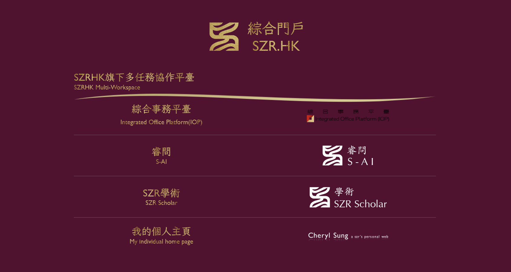
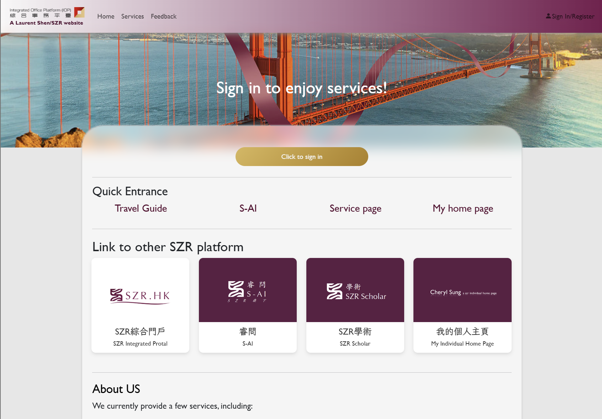
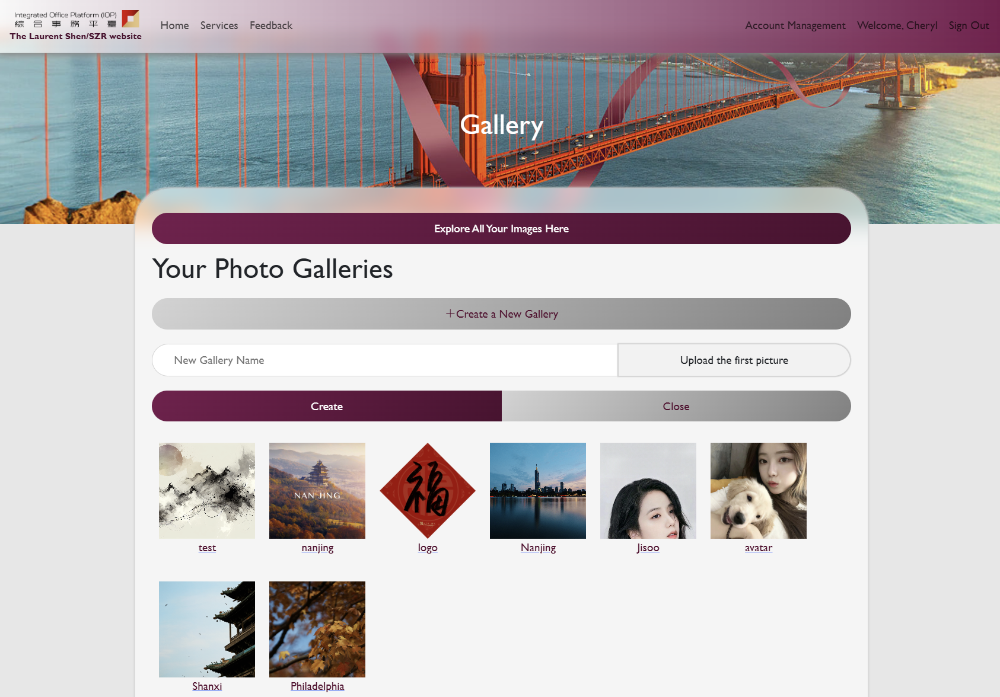
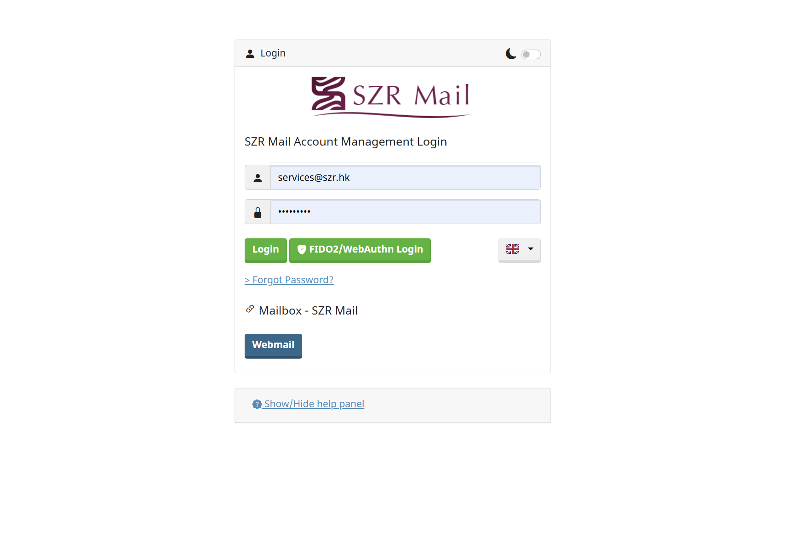
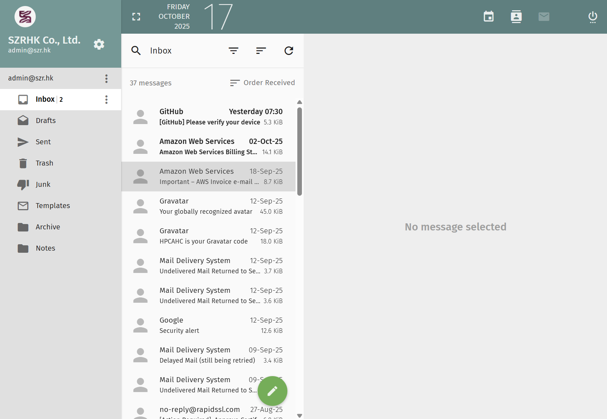
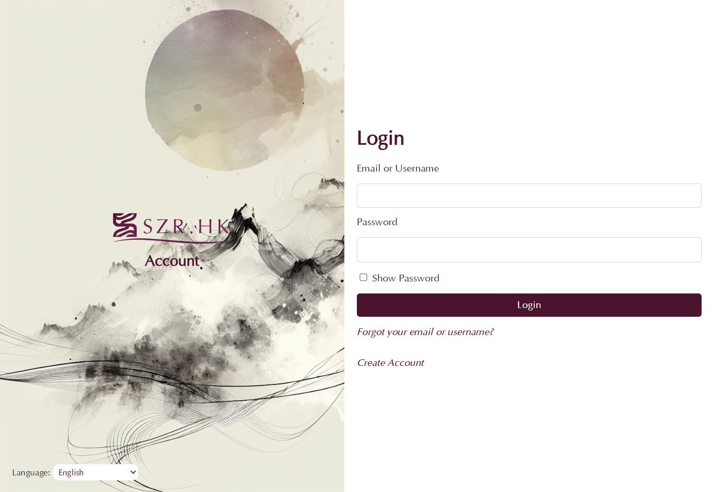

# 🌐 SZR Cloud Ecosystem


> A full-stack, open-source ecosystem integrating **AI**, **Cloud Drive**, **Email**, and **User Management** — built to demonstrate scalable web architecture and secure LLM service integration.
---
> Thanks for your view, and I am now still working on the perfection of service installation process:)

---

## 🚀 Overview

**SZR Cloud Ecosystem** (`https://szr.hk`) is a self-hostable platform unifying:
- **AI Services** — OCR + LLM text analysis for image-embedded documents  
- **Mail System** — Postfix + Dovecot stack with DKIM/SPF and web/mobile clients  
- **Cloud Drive** — Cross-device file storage with resumable uploads  
- **Unified Authentication** — JWT/SSO-based identity across modules  
- **Productivity Tools** — Notes, scheduler, and collaborative file management  

It demonstrates a **production-grade, modular architecture** combining **Vue.js / PHP / Node.js / MySQL / Redis** and end-to-end system design principles.

---

## 🧩 Architecture Overview

Each module communicates through RESTful APIs behind a unified gateway.

```
Frontend (Vue.js + Flutter)
        ↓
Node.js Gateway — Redis Cache
        ↓
PHP Backend — MySQL Database
        ↓
Nginx Reverse Proxy — SSL/TLS
```

For detailed diagrams, see [`docs/architecture.md`](docs/architecture.md).

---

## 🛠️ Installation

### Option 1 — Simple Shell Setup (Ubuntu/Debian)

```bash
sudo apt update
sudo apt install -y git curl nginx mysql-server redis php php-mysql unzip
git clone https://github.com/LaurentShen/szr-cloud-ecosystem.git
cd szr-cloud-ecosystem
bash scripts/install.sh
```

Then visit:
```
http://localhost  or  https://your-domain
```

> ⚙️ Default credentials and `.env` configuration can be found in `backend/php/.env.example`.

---

### Option 2 — Docker Compose Deployment (Recommended)

```bash
git clone https://github.com/LaurentShen/szr-cloud-ecosystem.git
cd szr-cloud-ecosystem
docker-compose up -d
```

> Docker will automatically start Nginx, PHP, Node, MySQL, and Redis containers.

---

## 💡 Core Modules

| Module | Description | Stack |
|--------|--------------|--------|
| **AI Services** | PDF-OCR, GPT-based LLM API Integration | Python, Node, Redis |
| **Cloud Drive** | Cross-device storage, resumable uploads | PHP, Vue.js, MySQL |
| **Mail System** | SMTP/IMAP with DKIM/SPF verification | Postfix, Dovecot |
| **Account System** | JWT/SSO unified identity | Redis, PHP, Node |
| **Frontend UI** | Dashboard + File management | Vue.js, Tailwind |

---

## 🧠 Design Philosophy

> *“From model to system — integrating AI capabilities into secure, production-ready infrastructure.”*

SZR Cloud Ecosystem was developed to bridge **AI research** and **system engineering**, providing:
- Modular and scalable design  
- LLM-based OCR pipeline  
- Secure session handling with Redis  
- Cloud-native deployability  

---

## 📸 Screenshots

**Home Dashboard**
<br>


**AI Document Service**
<br>


**Office & Cloud Drive**
<br>



**Email Client**
<br>



**Unified Login System**
<br>


---

## 📚 Documentation

For full system design and deployment details, see:
- [`docs/architecture.md`](docs/architecture.md)
- [`docs/modules.md`](docs/modules.md)
- [`docs/deployment.md`](docs/deployment.md)

---

## 🔗 Live Demo
**🌍 Website:** [https://szr.hk](https://szr.hk)

---

## 🧑‍💻 Author
**Zhairui Shen**  
Email: [me@szr.hk](mailto:me@szr.hk)  
GitHub: [LaurentShen](https://github.com/LaurentShen)

---

## 🪪 License
MIT License © 2025 SZR.HK
